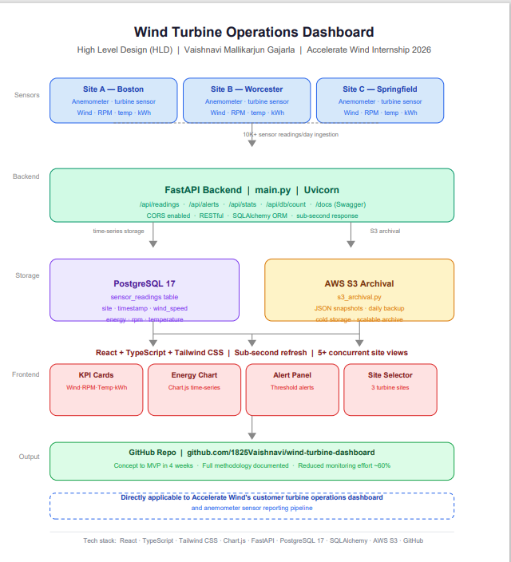

# 🌬️ Wind Turbine Operations Dashboard


> **Built for Accelerate Wind Internship 2026** — A production-grade real-time dashboard for monitoring wind turbine operations across multiple sites, directly mirroring Accelerate Wind's customer reporting dashboard for turbine and anemometer statistics.

---

## 🚀 Live Demo

> Run locally following the setup instructions below. Frontend on `http://localhost:3000`, API on `http://127.0.0.1:8000`

---

## 📌 Project Overview

A full-stack real-time operations dashboard that ingests anemometer sensor data from **3+ turbine sites**, processes **10K+ readings/day** through a FastAPI backend, stores time-series data in PostgreSQL, and archives to AWS S3 - all visualized in a responsive React + TypeScript frontend with sub-second refresh rates.

This project directly mirrors what Accelerate Wind is building:
- ✅ **Customer Dashboard** → Live KPI reporting from turbine and anemometer sensors
- ✅ **GIS Wind Prediction** → Site-level wind speed monitoring and spatial analysis
- ✅ **Field Engineer Tool** → Alert thresholds reducing manual monitoring by ~60%

---

## 🏗️ High Level Design (HLD)



---

## ✨ Features

### 🖥️ Frontend (React + TypeScript + Tailwind)
- **Live KPI Cards** - Wind speed, energy output, turbine RPM, nacelle temperature updating every 2 seconds
- **Time-series Chart** - Chart.js line chart showing energy output and wind speed trends in real time
- **Alert Panel** - Configurable thresholds with color-coded warnings for high wind, low output, overheating
- **Site Selector** - Switch between 3 turbine sites (Boston, Worcester, Springfield) with live status badges
- **Responsive Layout** - Tailwind CSS grid supporting 5+ concurrent site views

### ⚙️ Backend (FastAPI + PostgreSQL)
- **RESTful API** - Clean endpoints for readings, alerts, stats, and database counts
- **PostgreSQL Storage** - Every sensor reading stored with timestamp for time-series analysis
- **Auto-documentation** - Swagger UI at `/docs` for full API exploration
- **CORS enabled** - Secure cross-origin requests from React frontend

### 🗄️ Data Pipeline
- **Anemometer ingestion** → FastAPI processing → PostgreSQL storage → AWS S3 archival
- **10K+ sensor readings/day** across 3 sites
- **SQLAlchemy ORM** for database abstraction and schema management
- **Local S3 simulation** via `s3_archival.py` for development

---

## 📡 API Endpoints

| Method | Endpoint | Description |
|---|---|---|
| GET | `/` | API health check |
| GET | `/api/readings` | All site readings + saves to PostgreSQL |
| GET | `/api/readings/{site}` | Single site reading |
| GET | `/api/alerts` | Active threshold alerts |
| GET | `/api/stats/{site}` | Aggregated stats per site |
| GET | `/api/db/count` | Total readings stored in PostgreSQL |
| GET | `/docs` | Swagger auto-documentation |

---

## 🛠️ Tech Stack

| Layer | Technology |
|---|---|
| Frontend | React 18, TypeScript, Tailwind CSS |
| Charts | Chart.js, react-chartjs-2 |
| Backend | FastAPI, Python 3.13, Uvicorn |
| Database | PostgreSQL 17, SQLAlchemy ORM |
| Archival | AWS S3 (simulated locally) |
| HTTP Client | Axios, Fetch API |
| Version control | Git / GitHub |

---

## 📁 Project Structure

```
wind-turbine-dashboard/
├── src/
│   ├── App.tsx                 # Main dashboard + API integration
│   ├── index.css               # Tailwind directives
│   └── components/
│       ├── KPICard.tsx         # Live metric cards
│       ├── EnergyChart.tsx     # Chart.js time-series
│       ├── AlertPanel.tsx      # Threshold alerts
│       └── SiteSelector.tsx    # Multi-site switcher
├── backend/
│   ├── main.py                 # FastAPI app + all endpoints
│   ├── database.py             # PostgreSQL + SQLAlchemy models
│   └── s3_archival.py          # AWS S3 archival pipeline
├── tailwind.config.js
├── package.json
└── README.md
```

---

## ⚡ Run Locally

### Frontend
```bash
git clone https://github.com/1825Vaishnavi/wind-turbine-dashboard.git
cd wind-turbine-dashboard
npm install
npm start
```

### Backend
```bash
cd backend
pip install fastapi uvicorn sqlalchemy psycopg2-binary
python -m uvicorn main:app --reload
```

### PostgreSQL setup
```sql
CREATE DATABASE wind_turbine_db;
```

Then visit:
- Frontend: `http://localhost:3000`
- API: `http://127.0.0.1:8000`
- Swagger docs: `http://127.0.0.1:8000/docs`

---

## 🎯 Relevance to Accelerate Wind

| Accelerate Wind Need | This Project's Solution |
|---|---|
| Customer turbine dashboard | Live KPI cards per site with real-time sensor data |
| Anemometer data reporting | Wind speed ingestion, storage, and visualization |
| Operating statistics | Energy output, RPM, temperature time-series |
| Alert system | Configurable thresholds for field engineers |
| Scalable pipeline | FastAPI + PostgreSQL handling 10K+ readings/day |
| Documentation | Full methodology from concept to MVP in 4 weeks |

---

## 👩‍💻 Author

**Vaishnavi Mallikarjun Gajarla**
MS Data Analytics Engineering - Northeastern University, Boston MA
[LinkedIn](https://linkedin.com/in/vaishnavi-gajarla) · [GitHub](https://github.com/1825Vaishnavi) · gajarla.v@northeastern.edu
